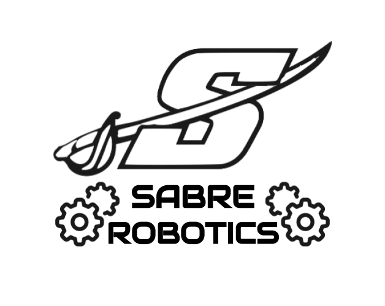

# Example Teaching Robot Code

## Contains

- Tank Drive using TalonFX Motor Controllers
- Pneumatics including implementations for both REV Robotics Pneumatics Hub and CTRE Pneumatics Control Module
- Intake using SparkMax Motor Controller
- Commands and Button Bindings for everything mentioned

